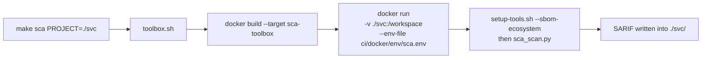
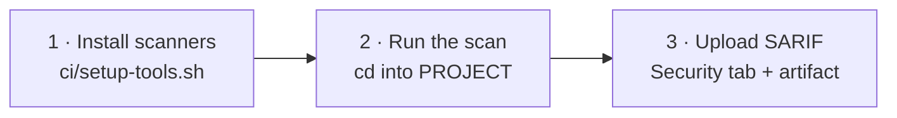

# DevSecOps Security Pipelines

Three reusable security pipelines (**SAST**, **SCA**, and **Container Scanning**) that run identically on your laptop and in GitHub Actions.

Each pipeline runs open source scanners, normalises their output to [SARIF](https://sarifweb.azurewebsites.net/), and applies a shared gate. Locally they run in purpose-built Docker images through a `make` command. In CI they run natively on the runner through the same `ci/` scripts.Nothing differs between the two environments except where the scripts run, so a finding you reproduce locally is exactly what CI reports.

Developed as part of **Google Summer of Code 2026** with [EBRAINS](https://www.ebrains.eu/), following the [OWASP DevSecOps Guideline](https://owasp.org/www-project-devsecops-guideline/), and deployed in the [Medical Informatics Platform](https://github.com/Medical-Informatics-Platform).

---

## Table of Contents

- [Repository Structure](#repository-structure)
- [The Three Pipelines](#the-three-pipelines)
- [Quick Start](#quick-start)
- [Running Locally: the Makefile](#running-locally-the-makefile)
- [Running in CI: GitHub Actions](#running-in-ci-github-actions)
- [Adopting in Your Own Repository](#adopting-in-your-own-repository)
- [The Gate](#the-gate)
- [Reading SARIF Reports](#reading-sarif-reports)
- [Configuring Semgrep Rulesets](#configuring-semgrep-rulesets)
- [Adding Your Own Ecosystem](#adding-your-own-ecosystem)
- [Suppressing a False Positive](#suppressing-a-false-positive)
- [Environment Variables](#environment-variables)
- [Related Resources](#related-resources)

---

## Repository Structure

```
.
├── Makefile                        # local entrypoint: make sast | sca | container-scan
├── toolbox.sh                      # builds and runs the Docker toolbox images
│
├── ci/                             # everything the pipelines need, vendor this folder
│   ├── setup-tools.sh              # installs scanners (SHA256 pinned) and generates SBOMs
│   ├── sast_scan.py                # SAST orchestrator      (OpenGrep)
│   ├── sca_scan.py                 # SCA orchestrator       (Trivy + OSV-Scanner)
│   ├── container_scan.py           # Container orchestrator (Hadolint, OpenGrep, Trivy, OSV)
│   ├── parse_sarif.py              # shared CVSS gate logic
│   │
│   ├── suppress_trivy.yaml         # your Trivy suppressions
│   ├── suppress_osv_scanner.toml   # your OSV-Scanner suppressions
│   │
│   └── docker/
│       ├── Dockerfile              # 3 toolbox images from one shared installer stage
│       ├── entrypoints/            # sca-entrypoint.sh
│       └── env/                    # sast.env | sca.env | container-scan.env
│
├── .github/workflows/              # reference CI, also this repo's own test suite
│   ├── sast.yml
│   ├── sca.yml
│   └── container-scan.yml
│
└── test-*/                         # sample targets used to exercise the pipelines
```

To adopt these pipelines in your own project, copy **`ci/`** plus the workflow file you need. Nothing else is required.

---

## The Three Pipelines

| Pipeline | Scanners | What it inspects | Gate |
|---|---|---|---|
| **SAST** | OpenGrep with [semgrep-rules](https://github.com/semgrep/semgrep-rules) | Your source code | Any `ERROR` severity rule match |
| **SCA** | Trivy, OSV-Scanner | A CycloneDX SBOM of your dependencies | CVSS threshold |
| **Container Scanning** | Hadolint, OpenGrep, Trivy, OSV-Scanner | Dockerfile **and** the built image | CVSS threshold + `ERROR` severity rule (combine both SAST and SCA) |

The pipelines are deliberately independent. No shared state, no ordering constraints. Run one, run all three, run them in parallel.

**SAST** is static analysis of your own code. OpenGrep (an open source fork of Semgrep) matches pattern based rules against the source tree.

**SCA** is Software Composition Analysis, meaning your third party dependencies. It generates a CycloneDX SBOM first, then scans that SBOM. This decouples the scanners from the package manager, so adding a language means teaching the SBOM step how to produce a bill of materials, not modifying the scanners.

**Container Scanning** combines both approaches against one image. It runs a SAST pass over the Dockerfile (Hadolint plus OpenGrep Dockerfile rules) and an SCA pass over the built image layers (Trivy plus OSV-Scanner), then merges all four SARIF reports into one before applying the gate. So a container scan can fail on a bad `RUN` instruction, on a vulnerable base image package, or on both.

---

## Quick Start

**Requirements:** Docker, `make`, and Bash. Nothing else, since the scanners are installed inside the images.

Container Scanning also needs the image built beforehand, and `toolbox.sh` mounts the Docker socket (`-v /var/run/docker.sock:/var/run/docker.sock`) so the toolbox can inspect it.

```bash
git clone https://github.com/moghit-eou/DevSecOps-CI-pipelines.git
cd DevSecOps-CI-pipelines

make sast PROJECT=./test-golang
make sca  PROJECT=./test-maven ECOSYSTEM=maven
```

The first run builds the toolbox image, which takes a few minutes because it downloads the scanners and the Trivy vulnerability database. Later runs reuse the cached layers and take seconds.

SARIF reports are written **inside `PROJECT`**.

---

## Running Locally: the Makefile

```bash
# SAST, scan source code
make sast PROJECT=<dir>

# SCA, resolve dependencies, build an SBOM, scan it
make sca PROJECT=<dir> ECOSYSTEM=<maven|npm|golang|generic|none>

# Container Scanning, the image must be built first
docker build -t myapp:local ./my-service
make container-scan IMAGE=myapp:local SCAN_TYPE=sast PROJECT=./my-service   # scan the Dockerfile
make container-scan IMAGE=myapp:local SCAN_TYPE=sca                          # scan the image

# Remove SARIF outputs and toolbox images
make clean
```

### How the local flow works

`make` calls `toolbox.sh`, which calls `docker run` with your project **bind mounted at `/workspace`**, which is the image's `WORKDIR`.



Runtime configuration lives in `ci/docker/env/*.env`. Edit those to change thresholds, output names, or suppression paths **without rebuilding the image**.

The scanners and the Trivy database are installed **once**, in a shared `toolbox-installer` stage. All three toolbox images copy from it, so switching between `make sast` and `make sca` costs nothing.

---

## Running in CI: GitHub Actions

The workflows in `.github/workflows/` are plain steps calling the same `ci/` scripts. No composite actions, no hidden indirection. Copy one into your repository and change the `env:` block.

Every workflow follows the same shape:



Every job needs:

```yaml
permissions:
  contents: read
  security-events: write   # to upload SARIF to the Security tab
```

### SAST

The rules are cloned **outside the checkout**, then referenced by absolute path:

```yaml
      - name: Install scanner and rules
        run: |
          mkdir -p "$GITHUB_WORKSPACE/../tools" && cd "$GITHUB_WORKSPACE/../tools"
          bash "$GITHUB_WORKSPACE/ci/setup-tools.sh" --install-tool opengrep,semgrep-rules

      - name: Run SAST scan
        working-directory: ${{ env.PROJECT }}
        run: python3 "$GITHUB_WORKSPACE/ci/sast_scan.py"
```

**Why outside the checkout:** the semgrep-rules repository ships thousands of deliberately vulnerable test fixtures. If it lands inside the folder being scanned, OpenGrep will scan those fixtures and flood you with findings. `$GITHUB_WORKSPACE/../tools` is outside the checkout and always safe. The local Docker flow achieves the same separation by baking rules into `/app/semgrep-rules`, outside the `/workspace` mount.

### SCA

Two mandatory settings, what to scan and which ecosystem it is:

```yaml
    env:
      PROJECT: .
      ECOSYSTEM: maven          # maven | npm | golang | generic | none
```

```yaml
      # cd into PROJECT, because setup-tools.sh writes the SBOM to the current directory
      - name: Install scanners and generate SBOM
        working-directory: ${{ env.PROJECT }}
        run: |
          bash "$GITHUB_WORKSPACE/ci/setup-tools.sh" \
            --install-tool trivy,osv-scanner \
            --sbom-ecosystem "$ECOSYSTEM"

      - name: Run SCA scan
        working-directory: ${{ env.PROJECT }}
        run: python3 "$GITHUB_WORKSPACE/ci/sca_scan.py"
```

Add your build toolchain before those steps if the runner lacks it (`actions/setup-node` for npm, `actions/setup-go` for Go). Maven is preinstalled on `ubuntu-latest`, and `generic` needs nothing.

Dependency caching by ecosystem:

| Ecosystem | Cache path | Key file |
|---|---|---|
| `maven` | `~/.m2/repository` | `pom.xml` |
| `npm` | `~/.npm` | `package-lock.json` |
| `golang` | `~/go/pkg/mod`, `~/.cache/go-build` | `go.sum` |
| `generic` | none, nothing is resolved | |

```yaml
      - name: Cache Maven packages
        uses: actions/cache@v6
        with:
          path: ~/.m2/repository
          key: ${{ runner.os }}-m2-v1-${{ hashFiles(format('{0}/**/pom.xml', env.PROJECT)) }}
          restore-keys: ${{ runner.os }}-m2-v1-
```

Note the key uses `format()` with `PROJECT`. A bare `**/pom.xml` hashes every project in a multi project repository, so the key churns on unrelated changes.

Dependency resolution (`mvn dependency:resolve`, `npm ci`, `go mod download`) lives in **`ci/setup-tools.sh`**, not in the workflow, so `make sca` resolves dependencies exactly the way CI does. The cache step only warms the download directory.

One caveat: `actions/cache` skips its save step when the job fails. Because a security gate is designed to fail, a project with an unfixable CVE will never populate its cache.

### Container Scanning

Two passes over one image, then a merge:

```yaml
      - name: Scan Dockerfile (Hadolint + OpenGrep)
        working-directory: ${{ env.PROJECT }}
        run: python3 "$GITHUB_WORKSPACE/ci/container_scan.py" --scan-type sast

      - name: Scan image for CVEs (Trivy + OSV-Scanner)
        working-directory: ${{ env.PROJECT }}
        run: python3 "$GITHUB_WORKSPACE/ci/container_scan.py" --scan-type sca --image "$IMAGE_NAME"

      - name: Merge SARIF reports
        working-directory: ${{ env.PROJECT }}
        run: |
          python3 "$GITHUB_WORKSPACE/ci/container_scan.py" \
            --merge-sarif "$TRIVY_SCA_SARIF_OUTPUT" "$OSV_SCA_SARIF_OUTPUT" \
                          "$OPENGREP_SAST_SARIF_OUTPUT" "$HADOLINT_SAST_SARIF_OUTPUT" \
            --merge-output "$MERGED_SARIF_OUTPUT"
```

The Dockerfile pass runs **inside `PROJECT`** on purpose. `container_scan.py` scans with `--include=Dockerfile` against the current directory, so running it from the repository root would pick up every Dockerfile in the repository.

---

## Adopting in Your Own Repository

Copy two folders. No submodule, no action to install.

| Step | What to do |
|---|---|
| 1 | Copy `ci/` to your repository root. Drop `ci/docker/` unless you also want the local `make` flow. |
| 2 | Copy the workflows you need from `.github/workflows/`. |
| 3 | Set `PROJECT` and `ECOSYSTEM` in each workflow's `env:` block. |
| 4 | Adjust thresholds, rulesets and suppression paths, see [Environment Variables](#environment-variables). |

What lands in your repository:

```
your-repo/
├── ci/
│   ├── setup-tools.sh
│   ├── sast_scan.py
│   ├── sca_scan.py
│   ├── container_scan.py
│   ├── parse_sarif.py
│   ├── suppress_trivy.yaml
│   └── suppress_osv_scanner.toml
└── .github/workflows/
    ├── sast.yml
    ├── sca.yml
    └── container-scan.yml
```

The minimum to edit:

```yaml
    env:
      PROJECT: .                    # folder to scan, relative to the repository root
      ECOSYSTEM: maven              # SCA only: maven | npm | golang | generic | none
      GATE_FAIL_THRESHOLD: "8.0"
      GATE_WARN_THRESHOLD: "5.0"
```

For a multi project repository, copy the workflow once per project and point `PROJECT` at each folder.

**Worked example:** [datacatalog PR #1](https://github.com/moghit-eou/datacatalog/pull/1), a multi project repository adopting these pipelines, one workflow per folder.

---

## The Gate

SCA and Container Scanning read the `security-severity` property (CVSS score) from every SARIF result and take the maximum:

| Max CVSS | Status | Exit code |
|---|---|---|
| at or above `GATE_FAIL_THRESHOLD` | **FAILED** | 1, blocks the pipeline |
| at or above `GATE_WARN_THRESHOLD`, below fail | **WARNING** | 0, logged only |
| below warn | **PASSED** | 0 |
| tool crashed or no SARIF | **ERROR** | 1, a broken scanner is never a pass |

Defaults are `8.0` and `5.0`. Override per project in a workflow:

```yaml
GATE_FAIL_THRESHOLD: "7.0"
GATE_WARN_THRESHOLD: "4.0"
```

or locally in `ci/docker/env/sca.env`, without quotes, since `--env-file` does not strip them:

```dotenv
GATE_FAIL_THRESHOLD=7.0
GATE_WARN_THRESHOLD=4.0
```

SAST gates differently. OpenGrep runs with `--severity=ERROR --error`, so any `ERROR` level rule match fails the job. There is no CVSS score to threshold on.

Reports upload **even when the gate fails**, because the upload steps are guarded on the SARIF file existing, not on the scan's exit code. A blocked build still publishes its findings.

---

## Reading SARIF Reports

SARIF is JSON, so it is readable but unpleasant by hand. Four ways to look at it:

1. **GitHub Security tab.** Uploaded automatically by the workflows, with findings mapped to lines of code.
2. **VS Code.** Install the [SARIF Viewer](https://marketplace.visualstudio.com/items?itemName=MS-SarifVSCode.sarif-viewer) extension, then open any `.sarif` file. It gives you a sortable findings list that jumps straight to the offending line, which is the fastest way to triage a local `make` run.
3. **In the browser.** Drop a `.sarif` file into the [SARIF Web Viewer](https://microsoft.github.io/sarif-web-component/). Nothing to install, and it works for sharing a report with someone who does not have the repository checked out.
4. **The workflow artifact.** Every job uploads its SARIF as a downloadable artifact, useful when a run fails before the Security tab upload.

---

## Configuring Semgrep Rulesets

`SEMGREP_CONFIG_RULESETS` is a space separated list. Two kinds of entry.

**1. Local folders** from the pinned [semgrep-rules](https://github.com/semgrep/semgrep-rules) clone. Browse that repository and add any top level directory:

```yaml
SEMGREP_CONFIG_RULESETS: >-
  ${{ github.workspace }}/../tools/semgrep-rules/generic
  ${{ github.workspace }}/../tools/semgrep-rules/java
  ${{ github.workspace }}/../tools/semgrep-rules/python
  ${{ github.workspace }}/../tools/semgrep-rules/terraform
```

**2. Registry packs** from [semgrep.dev/explore](https://semgrep.dev/explore), referenced as `p/<name>`:

```yaml
  p/default p/owasp-top-ten p/secrets auto
```

`auto` lets OpenGrep pick language appropriate rules automatically.

| Entry | Behaviour |
|---|---|
| Local folder path | Uses the **pinned** ruleset commit, fully reproducible |
| `p/<name>` | Fetched from the registry at scan time, may drift between runs |
| `auto` | Language detected registry rules |

For reproducible results, prefer local folders. `SEMGREP_RULES_REF` in `ci/setup-tools.sh` pins the exact ruleset commit, so the same input always yields the same findings.

In the local Docker flow the equivalent setting lives in `ci/docker/env/sast.env`, pointing at `/app/semgrep-rules/...`.

---

## Adding Your Own Ecosystem

SCA works with any language. Adding one means teaching `ci/setup-tools.sh` how to produce a CycloneDX SBOM for it. The scanners never change, because they only ever see an SBOM.

**Step 1.** Add a `case` branch in `ci/setup-tools.sh`:

```bash
  gradle)
    echo "Generating SBOM for Gradle project"
    mkdir -p target
    ./gradlew cyclonedxBom -q
    cp build/reports/bom.json target/bom.json
    ;;
```

**Step 2.** Install the build tool in the `sca-toolbox` stage of `ci/docker/Dockerfile`, so the local flow has it:

```dockerfile
RUN apt-get update && apt-get install -y --no-install-recommends \
      maven gradle \
    && rm -rf /var/lib/apt/lists/*
```

**Step 3** (CI only, optional). Add an `actions/cache` block for the ecosystem's dependency directory.

Then use it:

```bash
make sca PROJECT=./my-gradle-service ECOSYSTEM=gradle
```

```yaml
ECOSYSTEM: gradle
```

### Prefer a native CycloneDX generator over `generic`

`ECOSYSTEM: generic` falls back to a Trivy filesystem scan, which needs no toolchain and is meant to work on any language. In practice it depends on Trivy recognising whatever lockfile your project uses, so coverage varies and it can quietly miss dependencies. It is a convenient starting point, but it is **not** the recommended long term choice:

| | Native CycloneDX plugin | `generic` (Trivy filesystem) |
|---|---|---|
| Dependency resolution | Yes, before the SBOM is built | No |
| Transitive dependencies | Complete | Only what appears in lockfiles |
| Version accuracy | Resolved versions | Declared ranges in some cases |
| Rate limiting | Avoided, dependencies are already cached | Can hit registry rate limits on cold runs |

Without a resolve step, dependencies may be fetched during the scan itself, which is where public registry rate limits (Maven Central in particular) start failing your builds intermittently. The built in ecosystems all run their resolve step first (`mvn dependency:resolve`, `npm ci`, `go mod download`) inside `setup-tools.sh`, so the SBOM is generated from an already populated local cache.

Use `generic` to get coverage quickly, then move to a proper ecosystem branch once the project matters.

---

## Suppressing a False Positive

Trivy and OSV-Scanner read ignore files whose paths come from the environment, so you can point them at your own files without touching pipeline code.

**Trivy**, in `ci/suppress_trivy.yaml`:

```yaml
vulnerabilities:
  - id: CVE-2025-12345
    statement: "Vulnerable code path is unreachable in our configuration."
    expires: 2026-12-31
```

**OSV-Scanner**, in `ci/suppress_osv_scanner.toml`:

```toml
[[IgnoredVulns]]
id = "GHSA-xxxx-yyyy-zzzz"
ignoreUntil = 2026-12-31
reason = "No fix available, mitigated at the network layer."
```

To use files from your own repository instead, repoint the variables:

```yaml
TRIVY_IGNOREFILE: ${{ github.workspace }}/security/trivy.yaml
OSV_IGNOREFILE: ${{ github.workspace }}/security/osv-scanner.toml
```

Always set an expiry and a reason. A suppression without a review date is a permanent blind spot.

**SAST has no ignore file.** OpenGrep findings are suppressed either at the rule level, or by excluding paths:

```yaml
OPENGREP_EXCLUDE: "*.sarif vendor/ testdata/ *.generated.go"
```

Patterns are relative to `PROJECT`, not the repository root.

- Trivy: [Filtering and ignore files](https://trivy.dev/docs/latest/configuration/filtering/#trivyignoreyaml)
- OSV-Scanner: [Ignore vulnerabilities by ID](https://google.github.io/osv-scanner/configuration/#ignore-vulnerabilities-by-id)

---

## Environment Variables

Set these in a workflow `env:` block for CI, or in `ci/docker/env/*.env` for local runs.

**Shared**

| Variable | Default | Purpose |
|---|---|---|
| `GATE_FAIL_THRESHOLD` | `8.0` | CVSS at or above this fails the pipeline |
| `GATE_WARN_THRESHOLD` | `5.0` | CVSS at or above this warns |

**SAST**

| Variable | Default | Purpose |
|---|---|---|
| `SEMGREP_CONFIG_RULESETS` | built in list | Space separated rulesets |
| `OPENGREP_EXCLUDE` | `*.sarif ci/ Dockerfile* ...` | Paths to skip, relative to `PROJECT` |
| `OPENGREP_SARIF_OUTPUT` | `sast-opengrep.sarif` | Report filename |

**SCA**

| Variable | Default | Purpose |
|---|---|---|
| `SBOM_ECOSYSTEM` | `none` | `maven`, `npm`, `golang`, `generic`, or `none` |
| `SBOM_PATH` | `target/bom.json` | SBOM location, relative to `PROJECT` |
| `TRIVY_IGNOREFILE` | `ci/suppress_trivy.yaml` | Trivy suppressions |
| `OSV_IGNOREFILE` | `ci/suppress_osv_scanner.toml` | OSV-Scanner suppressions |
| `TRIVY_SARIF_OUTPUT` | `sca-trivy.sarif` | Trivy report |
| `OSV_SARIF_OUTPUT` | `sca-osv-scanner.sarif` | OSV-Scanner report |
| `SCA_MERGED_SARIF_OUTPUT` | `sca-merged.sarif` | Combined report |

**Container Scanning**

| Variable | Default | Purpose |
|---|---|---|
| `DOCKERFILE_PATH` | `Dockerfile` | Dockerfile name, relative to `PROJECT` |
| `TRIVY_SCA_SARIF_OUTPUT` | | Image CVE report from Trivy |
| `OSV_SCA_SARIF_OUTPUT` | | Image CVE report from OSV-Scanner |
| `OPENGREP_SAST_SARIF_OUTPUT` | | Dockerfile findings from OpenGrep |
| `HADOLINT_SAST_SARIF_OUTPUT` | | Dockerfile findings from Hadolint |

**Tool versions** are pinned in `ci/setup-tools.sh` and overridable by environment variable. Every binary is verified against a pinned SHA256, so overriding a `*_VERSION` requires overriding the matching `*_SHA256` too. [Renovate](https://docs.renovatebot.com/) markers keep both in sync automatically.

---

## Related Resources

- **Live implementations**, these pipelines in production:
  [platform-backend](https://github.com/Medical-Informatics-Platform/platform-backend/tree/master/.github/workflows) (Maven),
  [platform-ui](https://github.com/Medical-Informatics-Platform/platform-ui/tree/master/.github/workflows) (npm)
- **EBRAINS DevSecOps Handbook**, extended guidance and case studies:
  [moghit-eou/EBRAINS-DevSecOps-handbook](https://github.com/moghit-eou/EBRAINS-DevSecOps-handbook)
- **Guideline**: [OWASP DevSecOps Guideline](https://owasp.org/www-project-devsecops-guideline/)
- **Scanners**: [Trivy](https://trivy.dev/), [OSV-Scanner](https://google.github.io/osv-scanner/), [OpenGrep](https://github.com/opengrep/opengrep), [Hadolint](https://github.com/hadolint/hadolint)
- **Rulesets**: [semgrep-rules](https://github.com/semgrep/semgrep-rules), [Semgrep Registry](https://semgrep.dev/explore)
- **Standards**: [SARIF](https://sarifweb.azurewebsites.net/), [CycloneDX](https://cyclonedx.org/)

---

 ## License

-Free to use. No restrictions.
+Licensed under the [MIT License](LICENSE).
+
+You may use, modify and redistribute this project, including commercially.
+The only condition is that the copyright and license notice stays with copies
+or substantial portions of the code.
