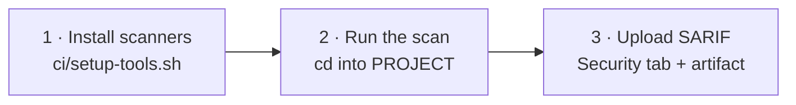

# Running in GitHub Actions

The workflows in `.github/workflows/` are plain steps calling the same `ci/` scripts
the local `make` flow uses. No composite actions, no hidden indirection. Copy one into
your repository and change the `env:` block.

Every workflow follows the same shape:



Every job needs:

```yaml
permissions:
  contents: read
  security-events: write   # to upload SARIF to the Security tab
```

`SARIF_CATEGORY` and `ARTIFACT_NAME` must be unique per job. GitHub replaces a
previous upload that shares a category, so two jobs using the same one will overwrite
each other's findings in the Security tab.

---

## SAST

The rules are cloned **outside the checkout**, then referenced by absolute path:

```yaml
      - name: Install scanner and rules
        run: |
          mkdir -p "$GITHUB_WORKSPACE/../tools" && cd "$GITHUB_WORKSPACE/../tools"
          bash "$GITHUB_WORKSPACE/ci/setup-tools.sh" --install-tool opengrep,semgrep-rules

      - name: Run SAST scan
        working-directory: ${{ env.PROJECT }}
        run: python3 "$GITHUB_WORKSPACE/ci/sast_scan.py"
```

**Why outside the checkout:** the semgrep-rules repository ships thousands of
deliberately vulnerable test fixtures. If it lands inside the folder being scanned,
OpenGrep will scan those fixtures and flood you with findings.
`$GITHUB_WORKSPACE/../tools` is outside the checkout and always safe. The local Docker
flow achieves the same separation by baking rules into `/app/semgrep-rules`, outside
the `/workspace` mount.

---

## SCA

Two mandatory settings, what to scan and which ecosystem it is:

```yaml
    env:
      PROJECT: .
      ECOSYSTEM: maven          # maven | npm | golang | generic | none
```

```yaml
      # cd into PROJECT, because setup-tools.sh writes the SBOM to the current directory
      - name: Install scanners and generate SBOM
        working-directory: ${{ env.PROJECT }}
        run: |
          bash "$GITHUB_WORKSPACE/ci/setup-tools.sh" \
            --install-tool trivy,osv-scanner \
            --sbom-ecosystem "$ECOSYSTEM"

      - name: Run SCA scan
        working-directory: ${{ env.PROJECT }}
        run: python3 "$GITHUB_WORKSPACE/ci/sca_scan.py"
```

Add your build toolchain before those steps if the runner lacks it
(`actions/setup-node` for npm, `actions/setup-go` for Go). Maven is preinstalled on
`ubuntu-latest`, and `generic` needs nothing.

### Dependency caching

| Ecosystem | Cache path | Key file |
|---|---|---|
| `maven` | `~/.m2/repository` | `pom.xml` |
| `npm` | `~/.npm` | `package-lock.json` |
| `golang` | `~/go/pkg/mod`, `~/.cache/go-build` | `go.sum` |
| `generic` | none, nothing is resolved | |

```yaml
      - name: Cache Maven packages
        uses: actions/cache@v6
        with:
          path: ~/.m2/repository
          key: ${{ runner.os }}-m2-v1-${{ hashFiles(format('{0}/**/pom.xml', env.PROJECT)) }}
          restore-keys: ${{ runner.os }}-m2-v1-
```

Note the key uses `format()` with `PROJECT`. A bare `**/pom.xml` hashes every project
in a repository that holds several, so the key churns on unrelated changes.

Dependency resolution (`mvn dependency:resolve`, `npm ci`, `go mod download`) lives in
`ci/setup-tools.sh`, not in the workflow, so `make sca` resolves dependencies exactly
the way CI does. The cache step only warms the download directory.

One caveat: `actions/cache` skips its save step when the job fails. Because a security
gate is designed to fail, a project with an unfixable CVE will never populate its
cache.

---

## Container Scanning

Two passes over one image, then a merge:

```yaml
      - name: Scan Dockerfile (Hadolint + OpenGrep)
        working-directory: ${{ env.PROJECT }}
        run: python3 "$GITHUB_WORKSPACE/ci/container_scan.py" --scan-type sast

      - name: Scan image for CVEs (Trivy + OSV-Scanner)
        working-directory: ${{ env.PROJECT }}
        run: python3 "$GITHUB_WORKSPACE/ci/container_scan.py" --scan-type sca --image "$IMAGE_NAME"

      - name: Merge SARIF reports
        working-directory: ${{ env.PROJECT }}
        run: |
          python3 "$GITHUB_WORKSPACE/ci/container_scan.py" \
            --merge-sarif "$TRIVY_SCA_SARIF_OUTPUT" "$OSV_SCA_SARIF_OUTPUT" \
                          "$OPENGREP_SAST_SARIF_OUTPUT" "$HADOLINT_SAST_SARIF_OUTPUT" \
            --merge-output "$MERGED_SARIF_OUTPUT"
```

The Dockerfile pass runs **inside `PROJECT`** on purpose. `container_scan.py` scans
with `--include=Dockerfile` against the current directory, so running it from the
repository root would pick up every Dockerfile in the repository.

The image must exist before the scan. Build it in an earlier step:

```yaml
      - name: Build image
        working-directory: ${{ env.PROJECT }}
        run: docker build -t "$IMAGE_NAME" .
```

---

## Several projects in one repository

Copy the job once per project and point `PROJECT` at each folder, or drive it from a
matrix. A working example covering a Maven backend, an npm frontend and a Python
project in a single repository is
[datacatalog PR #18](https://github.com/Medical-Informatics-Platform/datacatalog/pull/18).

Whichever you choose, give every job its own `SARIF_CATEGORY` and `ARTIFACT_NAME`.

---

## Keeping the scanners current

Tool versions and their SHA256 checksums are pinned in `ci/setup-tools.sh` and carry
[Renovate](https://docs.renovatebot.com/) markers, so both move together when a new
release lands. `renovate.json` and `.github/dependabot.yml` in this repository are
working configurations you can copy alongside `ci/`.
