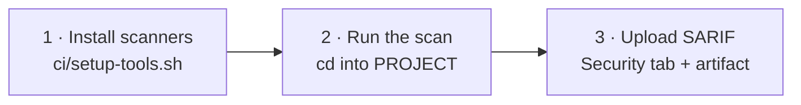

# Running in GitHub Actions

The workflows in `.github/workflows/` are plain steps calling the same `ci/` scripts
the local `make` flow uses. No composite actions, no hidden indirection. Copy one into
your repository and change the `env:` block.

Every workflow follows the same shape:



Every job needs:

```yaml
permissions:
  contents: read
  security-events: write   # to upload SARIF to the Security tab
```

`SARIF_CATEGORY` and `ARTIFACT_NAME` must be unique per job. GitHub replaces a
previous upload that shares a category, so two jobs using the same one will overwrite
each other's findings in the Security tab.

---

## SAST

The rules are cloned **outside the checkout**, then referenced by absolute path:

```yaml
      - name: Install scanner and rules
        run: |
          mkdir -p "$GITHUB_WORKSPACE/../tools" && cd "$GITHUB_WORKSPACE/../tools"
          bash "$GITHUB_WORKSPACE/ci/setup-tools.sh" --install-tool opengrep,semgrep-rules

      - name: Run SAST scan
        working-directory: ${{ env.PROJECT }}
        run: python3 "$GITHUB_WORKSPACE/ci/sast_scan.py"
```

**Why outside the checkout:** the semgrep-rules repository ships thousands of
deliberately vulnerable test fixtures. If it lands inside the folder being scanned,
OpenGrep will scan those fixtures and flood you with findings.
`$GITHUB_WORKSPACE/../tools` is outside the checkout and always safe. The local Docker
flow achieves the same separation by baking rules into `/app/semgrep-rules`, outside
the `/workspace` mount.

---

## SCA

Two mandatory settings, what to scan and which ecosystem it is:

```yaml
    env:
      PROJECT: .
      ECOSYSTEM: maven          # maven | npm | golang | generic | none
```

```yaml
      # cd into PROJECT, because setup-tools.sh writes the SBOM to the current directory
      - name: Install scanners and generate SBOM
        working-directory: ${{ env.PROJECT }}
        run: |
          bash "$GITHUB_WORKSPACE/ci/setup-tools.sh" \
            --install-tool trivy,osv-scanner \
            --sbom-ecosystem "$ECOSYSTEM"

      - name: Run SCA scan
        working-directory: ${{ env.PROJECT }}
        run: python3 "$GITHUB_WORKSPACE/ci/sca_scan.py"
```

### You probably do not need a `setup-*` action

`ubuntu-latest` already ships the toolchains these pipelines resolve with. On the
Ubuntu 24.04 runner image that currently means Node.js 22 and npm 10, Go, Temurin JDK
17 with Maven 3.9, and Python 3.12. So for a normal npm, Maven or Go project the
dependency resolution inside `setup-tools.sh` works with no `actions/setup-node`,
`actions/setup-java` or `actions/setup-go` step at all. None of the three production
adoptions linked from the README use one.

Add a `setup-*` action only when you need a **specific** version, not to make the
toolchain exist:

- your project requires a version other than the runner default (an older JDK, a Node
  version your lockfile was built against)
- you want the version pinned so a runner image update cannot move it under you

`ECOSYSTEM: generic` resolves nothing and needs no toolchain either way.

The one setup action the workflows do use is `actions/setup-python`, and that is a
pinning choice rather than an availability one. Python is preinstalled, but the
orchestrator scripts run on a pinned version so behaviour does not drift when the
runner image changes.

### Dependency caching

| Ecosystem | Cache path | Key file |
|---|---|---|
| `maven` | `~/.m2/repository` | `pom.xml` |
| `npm` | `~/.npm` | `package-lock.json` |
| `golang` | `~/go/pkg/mod`, `~/.cache/go-build` | `go.sum` |
| `generic` | none, nothing is resolved | |

```yaml
      - name: Cache Maven packages
        uses: actions/cache@v6
        with:
          path: ~/.m2/repository
          key: ${{ runner.os }}-m2-v1-${{ hashFiles(format('{0}/**/pom.xml', env.PROJECT)) }}
          restore-keys: ${{ runner.os }}-m2-v1-
```

Note the key uses `format()` with `PROJECT`. A bare `**/pom.xml` hashes every project
in a repository that holds several, so the key churns on unrelated changes.

Dependency resolution (`mvn dependency:resolve`, `npm ci`, `go mod download`) lives in
`ci/setup-tools.sh`, not in the workflow, so `make sca` resolves dependencies exactly
the way CI does. The cache step only warms the download directory.

One caveat: `actions/cache` skips its save step when the job fails. Because a security
gate is designed to fail, a project with an unfixable CVE will never populate its
cache.

---

## Container Scanning

Two passes over one image, then a merge:

```yaml
      - name: Scan Dockerfile (Hadolint + OpenGrep)
        working-directory: ${{ env.PROJECT }}
        run: python3 "$GITHUB_WORKSPACE/ci/container_scan.py" --scan-type sast

      - name: Scan image for CVEs (Trivy + OSV-Scanner)
        working-directory: ${{ env.PROJECT }}
        run: python3 "$GITHUB_WORKSPACE/ci/container_scan.py" --scan-type sca --image "$IMAGE_NAME"

      - name: Merge SARIF reports
        working-directory: ${{ env.PROJECT }}
        run: |
          python3 "$GITHUB_WORKSPACE/ci/container_scan.py" \
            --merge-sarif "$TRIVY_SCA_SARIF_OUTPUT" "$OSV_SCA_SARIF_OUTPUT" \
                          "$OPENGREP_SAST_SARIF_OUTPUT" "$HADOLINT_SAST_SARIF_OUTPUT" \
            --merge-output "$MERGED_SARIF_OUTPUT"
```

The Dockerfile pass runs **inside `PROJECT`** on purpose. `container_scan.py` scans
with `--include=Dockerfile` against the current directory, so running it from the
repository root would pick up every Dockerfile in the repository.

The image must exist before the scan. Build it in an earlier step:

```yaml
      - name: Build image
        working-directory: ${{ env.PROJECT }}
        run: docker build -t "$IMAGE_NAME" .
```

---

## Who can see your reports

Each pipeline publishes its findings through two channels, and they do **not** have
the same access rules:

| Channel | Who can see it |
|---|---|
| Security tab (`upload-sarif`) | People with **write** access, so your team |
| Workflow artifact (`upload-artifact`) | Anyone with **read** access, which on a public repository is every signed-in GitHub user |

On a public repository that second row means your full list of unpatched CVEs is
downloadable by anyone with a GitHub account.

Whether that matters is your call. Three options:

- **Drop the artifact.** Delete the `upload-artifact` step. The Security tab still
  gets everything, and your team loses nothing but the downloadable copy.
- **Leave it public.** Fine for a project where the findings are not sensitive.
- **Encrypt it.** Keep the artifact, but make it useless to anyone without the
  password.

### Optional: encrypting the artifact

This is optional. Add it only if you chose the third option above.

Create a repository secret named `ARTIFACT_PASSWORD`, then put this between the scan
step and the upload step:

```yaml
      - name: Encrypt SARIF report
        id: encrypt
        if: ${{ !cancelled() && hashFiles(env.OPENGREP_SARIF_OUTPUT) != '' }}
        env:
          PW: ${{ secrets.ARTIFACT_PASSWORD }}
          OUT: ${{ env.OPENGREP_SARIF_OUTPUT }}.gpg
        run: |
          if [ -z "$PW" ]; then
            echo "::warning title=SARIF not uploaded::ARTIFACT_PASSWORD unavailable (Dependabot, Renovate or fork PR). Skipping."
            rm -f -- "$OPENGREP_SARIF_OUTPUT"
            exit 0
          fi
          printf '%s' "$PW" | gpg --symmetric --batch --yes --quiet \
            --pinentry-mode loopback --passphrase-fd 0 \
            --no-symkey-cache --cipher-algo AES256 \
            --s2k-mode 3 --s2k-digest-algo SHA512 --s2k-count 65011712 \
            --output "$OUT" -- "$OPENGREP_SARIF_OUTPUT"
          rm -f -- "$OPENGREP_SARIF_OUTPUT"
          echo "encrypted=$OUT" >> "$GITHUB_OUTPUT"

      - name: Upload encrypted SARIF artifact
        if: ${{ !cancelled() && steps.encrypt.outputs.encrypted != '' }}
        uses: actions/upload-artifact@v7
        with:
          name: sast-report
          path: ${{ steps.encrypt.outputs.encrypted }}
          retention-days: 30
          if-no-files-found: error
```

Swap `OPENGREP_SARIF_OUTPUT` for the report variable of whichever pipeline you are
editing (`SCA_MERGED_SARIF_OUTPUT` for SCA, `MERGED_SARIF_OUTPUT` for Container
Scanning).

Points worth knowing:

- The plaintext SARIF is deleted in both branches, so it can never reach the artifact.
- Runs without access to the secret (Dependabot, Renovate, fork PRs) skip the upload
  and log a warning instead of failing.
- The Security tab copy stays unencrypted, and that is deliberate. It is already
  restricted to people with write access, so there is nothing to protect it from.

To read a report:

```bash
gpg --decrypt sast-opengrep.sarif.gpg > sast-opengrep.sarif
```

Anyone holding the password can decrypt, so treat it like any shared credential and
rotate it when someone leaves the project.

Live example: [platform-backend](https://github.com/Medical-Informatics-Platform/platform-backend)
and [platform-ui](https://github.com/Medical-Informatics-Platform/platform-ui) both run
this on all three pipelines.

---

## Several projects in one repository

Copy the job once per project and point `PROJECT` at each folder, or drive it from a
matrix. A working example covering a Maven backend, an npm frontend and a Python
project in a single repository is
[datacatalog PR #18](https://github.com/Medical-Informatics-Platform/datacatalog/pull/18).

Whichever you choose, give every job its own `SARIF_CATEGORY` and `ARTIFACT_NAME`.

---

## Keeping the scanners current

Tool versions and their SHA256 checksums are pinned in `ci/setup-tools.sh` and carry
[Renovate](https://docs.renovatebot.com/) markers, so both move together when a new
release lands. `renovate.json` and `.github/dependabot.yml` in this repository are
working configurations you can copy alongside `ci/`.
