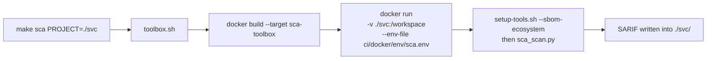

# Running locally

The same `ci/` scripts CI runs, executed inside purpose-built Docker images so you do
not have to install any scanner on your machine.

**Requirements:** Docker, `make` and Bash.

---

## The commands

```bash
# SAST, scan source code
make sast PROJECT=<dir>

# SCA, resolve dependencies, build an SBOM, scan it
make sca PROJECT=<dir> ECOSYSTEM=<maven|npm|golang|generic|none>

# Container Scanning, the image must be built first
docker build -t myapp:local ./my-service
make container-scan IMAGE=myapp:local SCAN_TYPE=sast PROJECT=./my-service   # scan the Dockerfile
make container-scan IMAGE=myapp:local SCAN_TYPE=sca                          # scan the image

# Remove SARIF outputs and toolbox images
make clean
```

`PROJECT` can point anywhere on your filesystem, not only inside this repository. The
`test-*/` folders here are sample targets for trying the pipelines out.

---

## How it works

`make` calls `toolbox.sh`, which calls `docker run` with your project **bind mounted
at `/workspace`**, the image's `WORKDIR`.



SARIF reports land **inside `PROJECT`**, next to the code they describe.

The scanners and the Trivy database are installed **once**, in a shared
`toolbox-installer` stage. All three toolbox images copy from it, so switching between
`make sast` and `make sca` costs nothing after the first build.

---

## Changing settings without rebuilding

Runtime configuration lives in `ci/docker/env/`, one file per pipeline:

```
ci/docker/env/
├── sast.env
├── sca.env
└── container-scan.env
```

Edit those to change thresholds, output filenames, rulesets or suppression paths. They
are passed with `--env-file` at run time, so no image rebuild is needed.

Two things to watch:

- **No quotes.** `--env-file` does not strip them, so `GATE_FAIL_THRESHOLD=7.0` works
  and `GATE_FAIL_THRESHOLD="7.0"` does not.
- **Ruleset paths differ from CI.** In the container the rules live at
  `/app/semgrep-rules/...`, baked in outside the `/workspace` mount. In CI they sit in
  `$GITHUB_WORKSPACE/../tools/semgrep-rules/...`. Same rules, different path.

Every available variable is listed in [configuration.md](configuration.md).

---

## Container Scanning needs the Docker socket

`toolbox.sh` mounts `/var/run/docker.sock` into the toolbox so the scanners can inspect
images on your host daemon. The image you name in `IMAGE=` must already be built and
visible to `docker images`.

`SCAN_TYPE=sast` also needs `PROJECT`, because the Dockerfile pass scans the current
directory. `SCAN_TYPE=sca` does not, because it reads the built image rather than the
source tree.

---

## Platform support

Developed and tested on Linux. macOS should work through Docker Desktop. On Windows,
use WSL2 rather than native PowerShell, since `toolbox.sh` and `setup-tools.sh` are
Bash scripts and the socket mount path is Linux specific.
